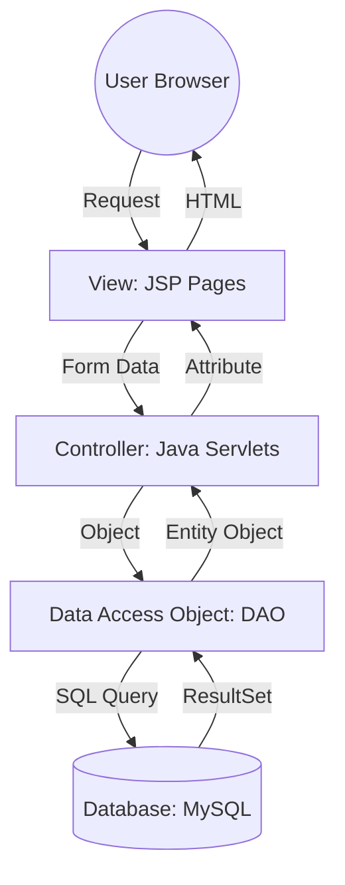

## 🚀 JobPortal: Full-Stack Career Platform

A comprehensive, role-based job portal application built using the Java MVC (Model-View-Controller) architecture. This platform bridges the gap between hiring managers and job seekers with a seamless, dynamic interface.

## ✨ Key Features

For Employers (Hiring Managers)
Job Management (CRUD): Post new job openings, update existing listings, or delete outdated ones.

Applicant Tracking: A dedicated dashboard to view everyone who has applied to their specific jobs, including applicant contact details.

Status Control: Toggle job listings between 'Active' and 'Inactive'.

For Job Seekers (Candidates)
Advanced Job Search: Filter jobs by specific locations or categories (IT, Finance, Marketing, etc.).

One-Click Apply: Quickly apply for jobs and prevent duplicate applications with built-in logic.

Application History: Track all previously applied jobs in a personal dashboard.

Profile Management: View and update personal information and account credentials.

## 🏗️ System Architecture (MVC Pattern)

The project follows the **Model-View-Controller (MVC)** design pattern to ensure a clean separation of concerns, making the code maintainable and scalable.

## 🛠️ Tech Stack

Backend: Java (Servlets & JSP)

Database: MySQL

Build Tool: Maven

Frontend: Bootstrap 5, FontAwesome, HTML5, CSS3

Server: Apache Tomcat 10+

Architecture: MVC (Model-View-Controller)

## 🧩 Components Explained:

View (JSP): Handles the presentation layer. Uses Bootstrap 5 for responsiveness and dynamic data rendering.

Controller (Servlets): The "Brain" of the app. It intercepts user requests, validates session data, and communicates with the Backend logic.

Model (Entities): POJOs like User.java and Job.java that represent our database tables.

Data Access Object (DAO): The "Bridge" to the database. Contains all SQL logic (Joins, CRUD, Filters) to keep the Servlets clean.

Database (MySQL): A relational storage system with optimized indexing for fast job searches.