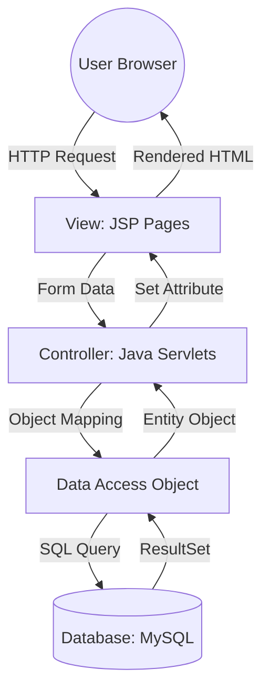

  

  

 

> **A comprehensive, role-based career platform bridging the gap between hiring managers and job seekers. Engineered strictly on the Java MVC (Model-View-Controller) architecture to deliver a seamless, dynamic, and scalable user experience.**

 

## 🛠️ Technology Stack

  
  
  
  
  

---

## 🏗️ System Architecture (MVC Pattern)

This platform was built adhering to the **Model-View-Controller** design pattern to ensure a clean separation of concerns, resulting in highly maintainable and easily scalable code.

| Component | Technology | Responsibility |
| :--- | :--- | :--- |
| **View** | `JSP`, `Bootstrap 5` | Handles the presentation layer. Responsible for responsive UI and rendering dynamic data passed from the Servlets. |
| **Controller** | `Java Servlets` | The "Brain" of the application. Intercepts HTTP requests, manages session states, validates data, and orchestrates backend logic. |
| **Model** | `Java POJOs` | Entity classes (e.g., `User.java`, `Job.java`) that serve as exact object representations of our database tables. |
| **DAO Layer** | `JDBC` | The "Bridge" to the database. Isolates all SQL logic (Joins, CRUD operations, Filters) to keep the Controllers clean and modular. |
| **Database** | `MySQL` | Relational storage system designed with optimized indexing to support fast, complex job search queries. |
    
    style User fill:#4f46e5,stroke:#312e81,stroke-width:2px,color:#fff
    style MySQL fill:#0ea5e9,stroke:#0284c7,stroke-width:2px,color:#fff
    style Servlet fill:#10b981,stroke:#047857,stroke-width:2px,color:#fff
---
##🚀 Core User Workflows

###🏢 B2B: For Employers (Hiring Managers)

Job Management (CRUD): Post new job openings, update active listings, or securely delete outdated requirements.

Applicant Tracking: A dedicated administrative dashboard to view all candidates who have applied to specific roles, complete with contact details.

Status Control: Granular control to toggle job visibility between 'Active' and 'Inactive' without deleting historical data.

##👤 B2C: For Job Seekers (Candidates)

Advanced Job Search: Filter the database by specific geographic locations or industry categories (IT, Finance, Marketing, etc.).

One-Click Apply: Streamlined application process with built-in backend logic to prevent duplicate submissions.

Application History: Personalized dashboard to track the status of all previously applied jobs.

Profile Management: Secure portal to update personal information and manage account credentials.
One-Click Apply: Streamlined application process with built-in backend logic to prevent duplicate submissions.

Application History: Personalized dashboard to track the status of all previously applied jobs.

Profile Management: Secure portal to update personal information and manage account credentials.
